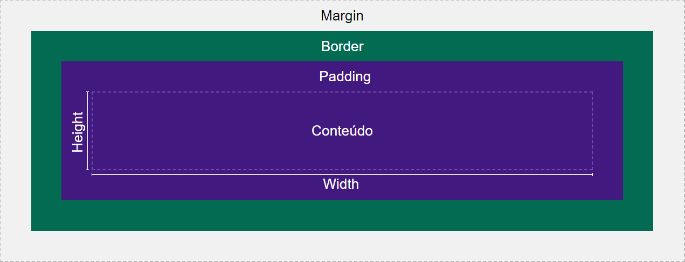

# What is HTML

**HTML**: Hyper Text Markup Language

> It is **not** a programming language, it is a markup language.

HTML was designed to be an effective way of sharing information through Internet. It can be interpreted as the skeleton of a web page. Each part of the skeleton is a `tag <>`.

The tags make all the difference when compared to a normal plain/text, because just pure text could not be effectively interpreted by the Browsers to properly mount the page.

---

# Tags & Attributes

**Structure**: <**tagName** *attributes*>tagContent</**tagName**>

## Common Tags

```html
<!DOCTYPE html> <!-- Tell the browser what is in the file ->
<html> <!-- Specifies the root of the web page ->
<head> <!-- Detailed page information (title, icon, meta charset, etc) ->
<body> <!-- Content of the web page ->
```

---

## Text Tags

```html
<h1> # Text sections of the page, goes up to <h6>
<p> # Generic paragraph
<br> # Generic break/line
<strong> # Tag content is bold
<i> # Tag content is italic
<ol> or <ul> # (Un)Ordered list | Unordered = * <li> | Ordered = Num. <li>
<li> # List item
```

---

## Common Attributes

```html
id="" <!-- Assign unique identifier to the tag ->
class="" <!-- Similar to id, but it doesn't need to be unique and can be applied to multiple elements ->
height="" & width="" <!-- Defines the size of the object in px, rem or % ->
alt="" <!-- Description of the object in text format. Used for accessibility or when the object cannot be loaded ->
```

---

## Common Combinations

```html
<meta charset=""><!-- Defines language pattern used in the page ->
<!--
**charset** is the character set (UTF-8, ISO-8859-1).
->

<!-- Image tag with source attribute. ->
<!--
**src** can be a link to an image (.jpg, .png, .gif).
->

<a href="" target=""> <!-- Converts the content into a clickable link. ->
<!--
**href** is where the user is directed. Can be an external link or a local tag
**target** changes how the link is opened. "_blank" = new tab
->
```

---

## Semantic HTML - Improved organization & accessibility

Below are the most used Semantic tags for HTML5

```html
<header></header> <!-- Tag used in page|article headers ->
<footer></footer> <!-- Tag used in page|article footers ->
<nav></nav> <!-- Tag used in navigation bars ->
<main></main> <!-- Tag used outside main page content ->
<article></article> <!-- Tag used outside articles ->
<section></section> <!-- Tag used for generic sections ->
```

# What is CSS?

**CSS**: Cascading Style Sheets

CSS is a styling language for HTML tags. It defines how HTML elements are organized and presented in the Client render interface.

## How to use?

It can be implemented in 3 ways:

1. The following can be added inside the `<head>` tag in the HTML page: `<style> #CSS Code </style>`;
2. `style="#CSS Code"` can also be used as an attribute of an HTML tag;
3. (**Recommended**) A separate file *example.css* can be created and the following can be added inside the `<head>` tag: `<link rel="stylesheet" href="pathTo\example.css"`.

---

```css
h1 {
/* Insert properties for <h1> tag here */
}

#exampleId {
/* Insert properties for id="exampleId" here */
}

.exampleClass {
/* Insert properties for class="exampleClass" here */
}
```

---

## Grouping in CSS

```css
/* Apply to multiple elements Ex: <p> + <div> */
p, div {
	/* CSS Props */
}

/* Apply to elements inside other elements Ex: <p> inside <div> */
div p {
 /* CSS Props */
}

/* Apply to pseudoclasses Ex: hover, focus */
div:property {
	/* CSS Props */
}
```

---

## Common Properties

```css
color & background-color /* Set foreground and background color (name, rgb, hex) */
width & height /* Set width and height (px, rem, %) */
font-family & font-size /* Set font family and its size (sans-serif, Helvetica)*/
```

---

## Font-family

There is a lot of fonts available to use in our CSS file. Some fonts will also not be available depending on the browser and computer it is executing. Some intersting examples to keep in mind:

- sans-serif: Default font used in the Client's browser/computer, generally simple. Can be used specially as a **backup font**. So you would set Ex: `font-family: Helvetica, sans-serif`;
- monospace: Font similar to the one used in writing machines. Each letter occupies the same space `width` wise;
- cursive: Manuscript like font;
- fantasy: Chronicle book like font.

---

## Box Model



### Overflow: How the content is shown in its area

```css
overflow: [prop]
					hidden /* Do not show content that doesn't fit */
					auto /* Create scroll if doesn't fit */ 
/* Variants */
overflow-y: /* Only apply to the y-axis */
overflow-x: /* Only apply to the x-axis */
```

---

### Position: How the other contents are seeing this one

```css
position: [prop]
					absolute /* Override, other elements ignore it */
					fixed /* Fixed position on screen, even on scroll */
					relative  /* Relative to content */

```

---

### Margin, padding & border: Define space around content

```css
margin: [value] /* Can receive up to 4 values, in order: top, right, bottom, left */
/* Separate Variants */
margin-top:
margin-bottom:
margin-left:
margin-right:

/* auto: defines margin automatically */
```

---

### Display: How the elements/containers should be displayed

```css
display: [value]
				 block /* Elements in different lines, 100% width, can change height */
				 inline /* Elements in same line, dynamic width, can't change height and y-margin */
				 inline-block /* Elements in same line, dynamic width, can change height */
				 inline-flex /* Align flex/flexbox items */
```

---

### Z-index: Order overriding elements. 1 is last, x is first

```css
z-index: [num];
```

---

### Float: Where content should stay in container

```css
float: [top, right, bottom, left]
```

---

## Flexbox - Simple item organization model

```css
#container {
	/* Container that wraps blocks */
	display: flex;
	flex-direction: row | column; /* Align as column or row */
	justify-content: left | center | right; /* Where to place content */ 
}

.block {
 /* Each block inside container property */
 align-self: flex-start | center | flex-end /* Where to place the block inside container */
}
```

# Misc

## Default spacing

```css
/* Remove default spacing from all of the elements */
* {
margin: 0;
padding: 0;
}
```

---

## Containers

Containers can be created inside `<section>` or `<div>` tags. They are useful especially when separating HTML sections and styles, you can use separate `class=""` attributtes.

---

## Span

`<span>` is an inline "container". Generally used to project icons or highlight text parts.

---

## Background-image

```css
background-image: /* Set background image of container */
background-size: cover /* Adapt image size to container size */ 
background-position: [x] [y] /* Where the background should start rendering */
```